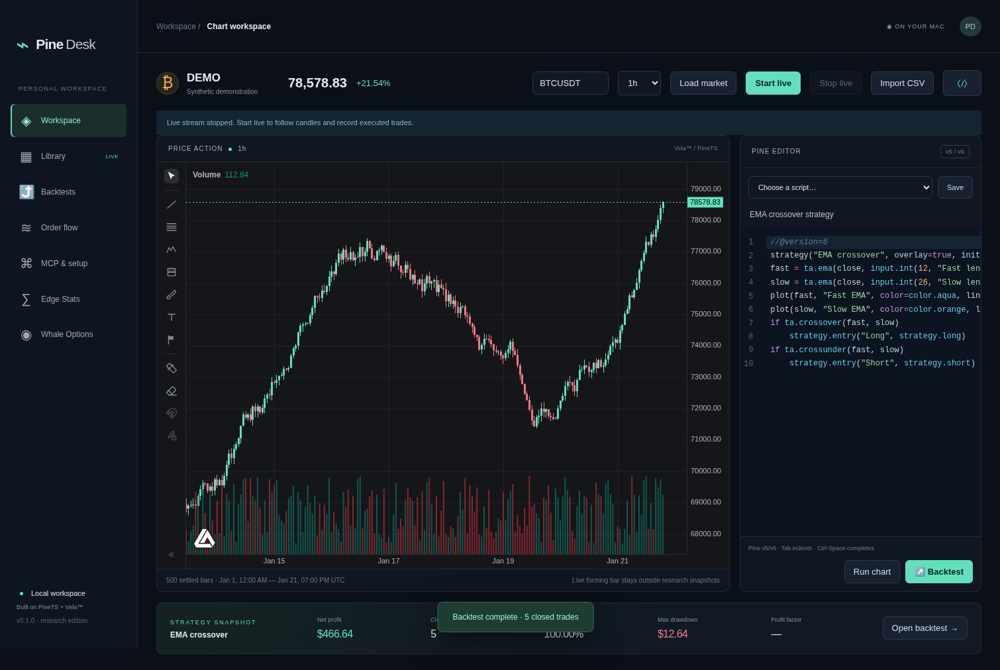

# Pine Desk

A local Mac trading research app built with [PineTS](https://github.com/LuxAlgo/PineTS), [Vela](https://velacharts.dev/), and Electron. Run native Pine v5/v6 scripts, explore the official LuxAlgo library through MCP, backtest strategies, and analyze executed trade data.



Documentation: [Custom scripts and LLM/MCP setup](docs/custom-scripts-and-mcp.md) · [Edge Stats](docs/edge-stats.md) · [Whale Options and feed access](docs/whale-options.md) · [Live Binance data](docs/live-data.md) · [Strategy research](docs/strategy-research.md) · [Crypto options & Greeks education](docs/crypto-options.md) · [Options project review](docs/options-project-review.md) · [Option research & replay](docs/option-research.md).

Signed distribution and automatic updates are prepared in the [release setup guide](docs/releases.md). Configure Apple signing/notarization secrets later, then manually run the Signed Mac release Action with an existing version tag.

## Run on your Mac

Install Node.js **22.16+** (Node 24 recommended), then:

```sh
git clone https://github.com/ar4ft/pine-desk.git
cd pine-desk
npm ci
npm run build
npm start
```

For development: `npm run dev`. For a local Apple Silicon and Intel DMG/ZIP build: `npm run dist:mac`. GitHub Actions also builds both Mac architectures after tests pass; download `pine-desk-mac-unsigned` from the Actions run. These packages are unsigned and unnotarized. Only the manually started Signed Mac release Action signs, notarizes and publishes both architectures once Apple credentials are configured; tag pushes do not start it. Development packaging explicitly disables signing and notarization. Signed releases support automatic updates through GitHub, with a restart prompt. No live trading or brokerage access is implemented.

## What's implemented

* **Charts:** Vela candlesticks, interactive navigation, drawings, volume, and a Pine editor with worker-based execution and a 30-second initial run deadline. Save scripts locally. The CodeMirror editor adds syntax highlighting, line numbers, autocomplete/snippets, search, undo, indentation and execution diagnostics. Editor drafts survive restart.
* **Data:** Fetch up to 1,000 settled Binance candles for 1m/5m/15m/1h/4h/1d. Import up to 50,000 OHLCV candles from CSV. Start/stop a continuous public Binance spot stream for candles and raw trades, with reconnects, candle reconciliation and visible trade-gap warnings. Forming candles stay outside research snapshots. Synthetic demo data is clearly labeled and requires no network.
* **LuxAlgo library:** Paginate the full catalog or search it through the official `https://mcp.luxalgo.com/mcp`. A live integration check returned 806 catalog entries on September 30, 2026. Fetch public source on demand, preserve it verbatim with provenance, save it, and run it in the chart. There is no bundled copy of all scripts.
* **Backtests:** Native PineTS `strategy(...)` execution, adjustable starting capital, percent-equity sizing, percent commission, tick slippage, no pyramiding beyond the configured limit, and next-bar market orders. View mark-to-market equity, closed-trade profit, trade count, win rate, drawdown, profit factor, long/short splits, per-trade P&L, and a trade ledger. Save/export the exact source, dataset, settings, and results for reproducibility.
* **Strategy research:** Bounded input parameter sweeps, rolling chronological walk-forward selection/testing, cancellable background jobs, saved study snapshots and 2–6 run comparisons with normalized equity. Walk-forward test windows reset state/capital without pre-test warmup; their closed P&L sum is not a continuous compounded portfolio.
* **Simulation:** Seeded Monte Carlo resampling of closed-trade **net cash P&L** with replacement, 200 paths, profit quantiles and loss probability. This does not compound position sizes or model intra-trade drawdown or dependence between trades.
* **Order flow:** Import executed trades with explicit aggressor sides. Compute per-bar footprints, volume delta, CVD, buy/sell trade counts, a full-import volume profile, and POC. View latest-bar footprint, profile, and CVD. Live Binance order flow uses the buyer-is-maker flag for aggressor side and retains the latest 50,000 raw prints. Live CVD/profile covers that window with explicit gap warnings. No buy/sell sides are inferred from OHLCV.
* **Edge Stats:** Official public hosted reports, coverage and freshness; optional local engine for custom DSL queries, preset parameters, grouped evidence and session-bar charts. Results retain N, Wilson confidence intervals and minimum-sample guards.
* **Whale Options:** Optional local engine connection for options flow, score/quote audits, gamma ladders, OI changes, max pain, IV history and net premium. Synthetic feed setup and licensed provider routes are documented.
* **Greeks Lab:** Independent interactive European-option education with call/put controls, spot/time/IV sensitivity curves, first and higher Greeks, explicit units, explanations, presets and a short exercise.
* **Crypto options:** Public Deribit BTC/ETH inverse-option chains, IV smiles, ATM/forward term structure, selected exchange-reported Greeks and acknowledged public WebSocket updates plus bounded option trade prints. No key required; snapshots and live coverage are labeled. Export JSON. Bybit USDC/USDT and OKX inverse REST adapters add explicit 30-second polling; fixture-tested because live endpoints return HTTP 403 here.
* **Option research:** Save/import/record full-chain snapshots and compare observations. Fixed-beta SABR with held-out diagnostics, 25-delta skew brackets, modeled gamma scenarios, six strategy templates, same-expiry multi-leg payoff/Greeks analysis, and saved bid/ask quote replays with settlement-currency cash, fees/slippage, supplied funding and static margin checks. [Method and limitations](docs/option-research.md).
* **MCP:** A separate local stdio server shares the app's dataset, scripts, imported trades, and saved runs. Official public LuxAlgo catalog calls are forwarded through its hosted MCP.

This is a working first research edition, not full parity with the LuxAlgo platform. It does not implement TPO, session/rolling profiles, footprint imbalances, order books, all platform screeners, nested/anchored optimization, session-aware walk-forward windows, or a standalone calendar engine, broker execution, or LuxAlgo account authentication. Library indicators are not automatically converted to strategies; specify entry/exit logic in a `strategy(...)` script.

## Chart and backtest workflow

1. Start with the synthetic chart, load a Binance symbol such as BTCUSDT, or import OHLCV CSV. Imported candles must be standard, chronological OHLCV bars; the app sorts them and rejects duplicate timestamps and invalid OHLC.
2. Choose an example or import public library source. Use **Run chart** for indicators and strategies. Vela provides the indicator legend/settings controls.
3. For backtests, open **Backtests**, configure costs and sizing, then run a `strategy(...)` script. The app overrides these declaration properties: `initial_capital`, `default_qty_type=percent_of_equity`, `default_qty_value`, `commission_type=percent`, `commission_value`, `slippage`, `pyramiding`, and `process_orders_on_close=false`. Explicit order `qty` values in source still take precedence over default sizing. Other script-declared properties remain active.
4. Inspect trades and equity, compare saved runs, or export a JSON snapshot. A saved run restores its own source, settings, and dataset for re-running. Chart indicators are separate from saved backtest runs.

Backtests use PineTS's broker emulator, not LuxAlgo's hosted service. They are not asserted to match TradingView or LuxAlgo tick-for-tick. Slippage is in PineTS symbol ticks; imported/offline data may use runtime-default tick metadata, so verify it for your instrument. Intrabar limits/stops depend on the runtime fill model. `request.security` needs an available secondary data provider; the offline array backtest path does not supply one. Unsupported runtime features produce errors or warnings. Historical OHLCV does not contain real executable tick paths.

Net profit and profit factor are calculated from **closed-trade net P&L**. Equity and drawdown come from the engine and include open positions. Account net profit separately includes entry commission on currently open trades; the exported metrics preserve that difference. A null profit factor means there are no losing closed trades, so the denominator is zero.

## CSV formats

OHLCV:

```csv
time,open,high,low,close,volume
2026-01-01T00:00:00Z,65000,65200,64800,65100,12.5
2026-01-01T01:00:00Z,65100,65300,65000,65200,11.2
```

Executed trades:

```csv
time,price,size,side
2026-01-01T00:00:01Z,65000,0.01,buy
2026-01-01T00:00:02Z,64990,0.02,sell
```

Time accepts ISO dates or Unix seconds/milliseconds. Trade `side` is the **aggressor**, not your position direction or maker side. Size is base-asset/contract quantity and must use consistent units. Trade imports are capped at 200,000 records / 20 MB. Intervals with no trades are omitted; CVD covers the imported range, not the entire market. LuxAlgo's own order flow uses licensed pre-aggregated footprint data; this app does not access that feed.

## MCP setup

With Node installed and `npm ci` completed, add this to an MCP client supporting stdio. Replace the path with your checkout's absolute path:

```json
{
  "mcpServers": {
    "pine-desk": {
      "command": "node",
      "args": ["/absolute/path/to/pine-desk/core/mcp.js"]
    },
    "luxalgo": {
      "url": "https://mcp.luxalgo.com/mcp"
    }
  }
}
```

The URL entry requires a client supporting Streamable HTTP; some clients use a different remote-server configuration shape. Public library tools need no key. The local server's stdout is reserved for MCP protocol traffic. `npm run mcp` also starts it; this is not an HTTP endpoint inside the desktop app.

Additional tools: five `live_*` streaming/flow tools, four `research_*` study tools plus `compare_runs`, seven `edge_*` tools and nine `whale_*` read-only tools (documented in their setup guides). These forward to the selected upstream services; their stores are separate from the chart dataset.

Local workspace tools: `workspace`, `load_market`, `import_bars`, `save_script`, `run_backtest`, `import_trades`, `order_flow`, `library_search`, `library_list`, `library_source`. Tool descriptions distinguish reads from local mutations. Only execute scripts you trust. Worker threads provide deadlines and memory limits, **not a security sandbox**; PineTS transpiles source into JavaScript in the local Node process. Do not expose the local server to untrusted remote callers.

App and MCP share `~/Library/Application Support/Pine Desk` on macOS (`~/.pine-desk` on Linux). Override both with `PINE_DESK_DATA_DIR`. Storage uses separate atomic JSON documents for bars, trades, scripts, and runs. No broker credentials or account tokens are stored. Saved runs contain full data snapshots and can use disk space over time.

## Verification

```sh
npm test
npx playwright install chromium
npm run test:ui
npm run build
npm run smoke:live   # optional: contacts public LuxAlgo MCP and Binance
npm run smoke:integrations # optional: requires local Edge demo + Whale synthetic servers
```

Tests verify known strategy fills and commissions, open-position accounting, execution deadlines, CSV validation, true-side order flow, reconnect/buffer/dedup logic, Pine input overrides, train-only walk-forward selection, research cancellation, editor completion/errors, live UI draft preservation, seeded simulation, upstream MCP forwarding and result guards, MCP handshake and persistence, and browser UI flows using the real local service. UI tests use a browser bridge in place of Electron IPC. Mac packaging runs separately in CI. On Linux, the desktop smoke test uses a display (for example `xvfb-run -a npm run test:desktop`).

## Licensing and source access

Pine Desk is AGPL-3.0-only because PineTS and Vela's PineTS addon are AGPL. Vela core is Apache-2.0; the LuxAlgo MCP implementation is MIT. See [NOTICE](NOTICE) and each dependency's own license. A private GitHub repository does not remove AGPL obligations when distributing the app. Ship corresponding source under the applicable terms. LuxAlgo offers [commercial licensing](https://www.luxalgo.com/licensing/) for other distribution models.

Catalog content and fetched Pine source retain their individual licenses. Free public access does not automatically permit redistribution or commercial embedding. The app preserves source comments and retrieval metadata; review each script's license before distributing it. Protected/premium scripts and private platform feeds require appropriate access and are not included. Pine Desk is an independent project and is not affiliated with or endorsed by LuxAlgo or TradingView.

## Where to obtain licensed access

The current app uses public access only. When you want to expand it:

1. **Commercial PineTS, Vela Pro, and Library rights:** start at [LuxAlgo Commercial Licensing](https://www.luxalgo.com/licensing/) and [Vela pricing](https://velacharts.dev/pricing/). Review the Developer License Agreement for developer seats, Business, and Enterprise eligibility, embedding rights, and any limits on redistributing source. A commercial PineTS license is the route to distributing a closed-source product without the open-source AGPL terms.
2. **Enterprise access or bespoke integration requirements:** use the [Enterprise section](https://www.luxalgo.com/licensing/#enterprise) or contact **business@luxalgo.com**, listed in LuxAlgo's licensing/support documents. Describe this desktop app and ask specifically for library source delivery, commercial embedding, Vela Pro order-flow components, and any supported footprint-data API/SDK.
3. **LuxAlgo hosted order-flow data:** [platform order-flow documentation](https://docs.luxalgo.com/platform/charts/order-flow/introduction) and [pricing](https://www.luxalgo.com/pricing/) describe platform features and lookback. A platform subscription is not documented as a general license to consume or redistribute those feeds in this independent app. Confirm API availability, authentication, symbol coverage, retention, and redistribution permissions with LuxAlgo before implementing an adapter. No private feed endpoint or API-key workflow is assumed here.
4. **Your own licensed data provider:** obtain historical OHLCV and executed-trade/footprint data with rights for desktop use. For real delta, the feed must carry aggressor-side volume (or documented bid/ask footprints), timestamps, quantity units, and instrument tick size. CSV imports already support public or properly licensed data; a live provider adapter would be an additional implementation.

LuxAlgo's licensing page describes self-hosted software components, rather than a hosted service in a licensee's data path. Software licensing and data API access are separate questions. Preserve credentials outside source control and add them through a provider-specific secure configuration when an actual API contract is available.

## Options data and provider settings

Enter your Unusual Whales token and Whale Options vendor credentials in **Settings**. The new **Options chart** provides signed OI GEX-by-strike bars, explicitly defined call/put walls and cumulative gamma-flip overlays, plus bounded live options-flow markers through the documented Unusual Whales WebSocket. Matching workspace charts can display the same overlays alongside Pine scripts. Credentials use operating-system encryption. Paid access/streaming entitlements are configured later with your own keys.

[Options setup, calculations and limitations](docs/options.md) · [Managed Whale Options engine](docs/whale-options.md#enter-credentials-and-launch-from-settings). Underlying candles and levels refresh every 30 seconds; missed options-stream events are flagged rather than replayed. Options contract/multi-leg quote replay is now available through a separate archived-chain research engine; it is not implemented by the underlying Pine strategy engine.

## Customize your workspace

Dark/light/macOS themes, candle colors and editor font size are available in Settings. Named layouts preserve candle snapshots, Pine/native indicators, drawings and pane arrangement; the last session restores automatically. Provider-qualified watchlists switch markets and fetch Binance quote snapshots. Import UTF-8 `.pine`/`.txt` sources directly through the native file picker. See [workspace customization](docs/workspaces.md).

Crypto options and education tools are documented in [their guide](docs/crypto-options.md#mcp). The [project review](docs/options-project-review.md) records upstream revisions, license findings, included features and deferred SABR/portfolio work. Run `npm run smoke:crypto` for an optional genuine public REST/WebSocket check.

Run `npm run smoke:options-research` for an isolated genuine Deribit capture, SABR/skew fit, model and two-observation replay. It submits no orders and removes its temporary store.
