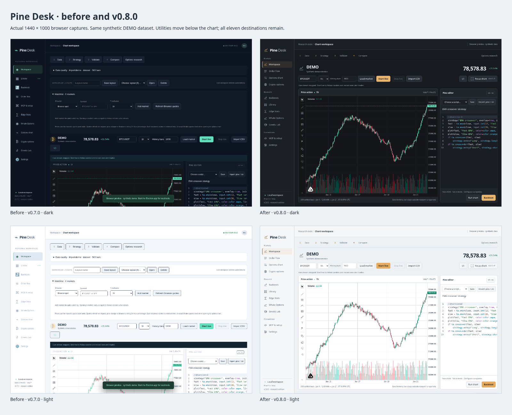

# Pine Desk design review · v0.8.0

A desktop adaptation of [App Designer](https://github.com/fortvna/app-designer/blob/main/app-designer/SKILL.md). The brief was inferred from the existing app and the requested redesign. The implementation remains Electron, PineTS and Vela.

[Before/after](before-after.png) · [Final contact sheet](shots/sheet.png) · [Interactive screenshot sheet](shots/sheet.html) · [Three directions](explore.html) · [Direction and tokens](DIRECTION.md) · [Scored critique](CRITIQUE.md).

## What changed

The chart and Pine editor lead the workspace: at 1440 × 1000 the chart starts near y=296 instead of y=730. Data quality, layouts and watchlists sit below them. Markets, Research and Connections group all eleven navigation destinations, with consistent SVG icons and the active destination announced to assistive technology.

Charcoal and ice surfaces share spacing, typography, control geometry and amber actions. Green/red still carry market direction; education model curves use amber. Default candles darken for light mode; other configured candle colours remain exact. Credential rows have consistent insets and spacing, and compact research empty states expose working controls sooner. Browser preview status sits in the header without covering working content.

**Focus chart** expands the existing chart without destroying it or discarding editor contents. Use Cmd+Shift+F on Mac, Ctrl+Shift+F elsewhere, and Escape to exit. The button displays the shortcut and current state; reduced motion removes its 160ms settling effect. Changing destinations resets the page to the top; working updates within the same destination preserve scroll position. Workflow links can still scroll directly to their target.

## Kept

- [x] All eleven destinations and provider settings.
- [x] Vela charts, drawings, indicators, Pine worker and editor diagnostics.
- [x] Data loading, live streams, CSV/script imports and saved source.
- [x] Backtests, sweeps, walk-forward studies, comparisons and saved results.
- [x] MCP, public catalog, Edge Stats and Whale Options connections.
- [x] Options charts, GEX/flow overlays, archive/replay and crypto options.
- [x] Greeks education and its numerical models.
- [x] Layouts, watchlists, quality controls, themes and custom candle colours.
- [x] Existing app identity, icon, signing rules and automatic-update configuration.

## Evidence and limits

Three rendered directions preceded implementation: Optical bench was selected; Market atlas was more suitable for reports, while Marine observatory's cobalt ground competed with chart colour semantics. The category's dark/lime finance default was deliberately replaced with amber actions and material separation.

The upstream exploration scan reports **zero FAILs** across all three directions; its iPhone safe-area warnings do not apply to desktop chrome, and the three hues are amber actions plus green/red market meaning. [Raw scan](explore-shots/scan.json). This scan covers the exploration, not a comprehensive accessibility audit of the shipped application.

Two independent visual review rounds reached the skill's stop criterion, with nine of twelve axes at 4/5 and none below 3/5. [Full findings](CRITIQUE.md). Browser captures use Linux system-font fallbacks, a 1440 × 1000 viewport and synthetic DEMO candles; they do not imply provider authentication. Mac font rendering and physical-device motion feel need human assessment on a Mac. The existing icon was retained rather than generating a new one.

Verification: 70 core tests and 15 browser tests; production build; source and packaged Electron smoke tests. The browser checks cover navigation, all eleven destinations in both themes at 1100 × 800, focus preserving chart DOM/source, layout persistence, live updates and options overlays. They are functional checks, not visual snapshot assertions.

To regenerate the final screenshot sheet, start `npx vite --host 127.0.0.1` and run `node scripts/design-review.js docs/design/shots` in another terminal. It uses Playwright, asserts that navigation resets scroll, and writes 26 PNGs plus a contact sheet. No account credentials are required. The standalone `explore.html` uses local synthetic data and no remote assets.

No design choice needs approval to use this version. Remaining design opportunities are a stronger product-specific identity and more distinctive research result presentations; they are not claimed as completed here.
