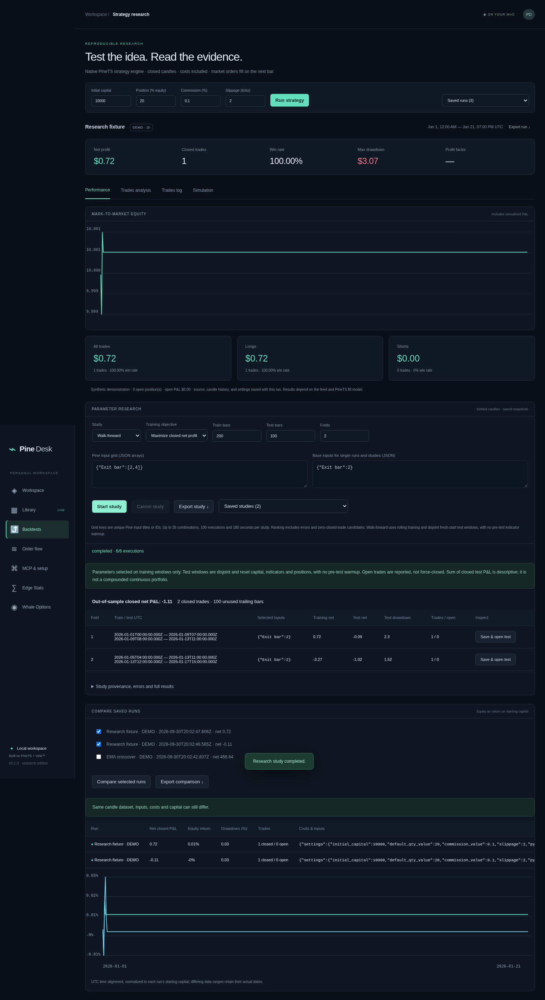

# Parameter sweeps, walk-forward studies and comparisons

Open **Backtests** after writing a native Pine strategy. Set capital, sizing, commission and slippage as usual. The parameter research panel executes the same PineTS child process and cost model as ordinary backtests.

## Pine input overrides

Use **Base inputs** JSON for a single run or study:

```json
{"Fast length":12,"Slow length":26}
```

Keys are unique Pine input titles, IDs such as `in_0`, or parsed variable IDs. Titles are usually easiest. Unknown/ambiguous keys and invalid typed input values produce errors. The default EMA example declares “Fast length” and “Slow length”. Base inputs also apply when you next Run chart. The PineTS runtime supplies omitted input defaults; source-declared `strategy.entry` quantity still overrides app default sizing.

The app passes overrides to PineTS's `Indicator` input mechanism; it does not replace numbers or rewrite your source. Run snapshots preserve source, overrides, costs, dataset and results. Vela's indicator settings remain available for chart-only editing; their separate edits are not automatically copied into backtest Base inputs.

## Parameter sweeps

Choose **Parameter sweep**, enter a grid and click **Start study**:

```json
{"Fast length":[8,12,20],"Slow length":[20,26,40]}
```

This runs the Cartesian product (nine combinations here), deduplicating repeated values. The limits are 1–6 dimensions, **25 combinations**, **100 total strategy executions** and **180 seconds per study**. One study runs per process, sequentially; each strategy execution retains the 30-second execution deadline. **Cancel study** terminates the active worker and stops remaining cases.

Choose an objective: maximize **closed-trade net profit**, or minimize **mark-to-market equity drawdown**. Errors remain visible; cases with no closed trades are displayed but excluded from ranking. Ties retain grid order. A low drawdown does not establish a useful strategy, so inspect trades, open positions and costs. A sweep is entirely **in-sample optimization**, with no holdout or multiple-testing correction. A best-ranked case is not evidence of future returns.

**Save & open run** turns any successful candidate into an ordinary saved backtest for detailed inspection and comparison. **Export study** includes the frozen source, dataset, settings, base inputs, grid, results, warnings and errors. Completed studies can be reopened from the saved-study selector.

## Walk-forward testing

Choose **Walk-forward** with training bars, test bars and fold count. With 200 train bars, 100 test bars and three folds:

| Fold | Training indexes | Test indexes |
| --- | --- | --- |
| 1 | 0–199 | 200–299 |
| 2 | 100–299 | 300–399 |
| 3 | 200–399 | 400–499 |

All intervals are chronological. Test windows do not overlap. The training window rolls forward by one test-window length; previous test data can enter later training because it is then past history. The app evaluates every candidate on training data, selects its objective winner **before** evaluating the next test window, and runs only that selection on the test data. It does not use test outcomes to choose parameters. If no training candidate has closed trades, the fold fails rather than choosing based on test performance.

Each fold starts with fresh capital and positions. Configure **Historical warmup bars** (0–5,000): earlier bars compute indicators with entry/order calls blocked until the test boundary. Desktop default is 100; API default is 0. Positions at window end remain reported and are not carried into the next fold.

The table reports selected inputs, train/test ranges, net profit, drawdown and open/closed counts. Closed test P&L still sums independently reset runs. Stitched equity additionally compounds normalized mark-to-market returns as a modeled composite, without state carry or boundary liquidation costs. These measures answer different questions.

Walk-forward requires at least 20 train bars, 10 test bars and 1–10 folds. Continuous data must be contiguous. Session markets accept an explicit timezone/open/close/weekdays/holiday/early-close calendar; missing open-session bars fail validation. Calendars are user-supplied. See [validation, calendar examples and limits](research-reliability.md#pine-validation-and-warmup). Nested validation and multiple-testing correction remain unimplemented.

Studies freeze their data at start. Live ticks do not mutate train/test boundaries or outcomes. Studies run in the background, so navigation remains usable. Closing the owning process cancels its job; saved status cannot resume it. A different process seeing an unfinished study labels it unavailable because it cannot tell whether the owner is still running or was interrupted.



## Compare saved runs

Select **2–6** saved runs and click **Compare selected runs**. The table reports closed net P&L, total equity return, drawdown percentage, closed/open counts, settings and input overrides. Equity curves are normalized to each run's starting capital and aligned on their actual UTC timestamps.

The backend checks complete symbol, timeframe and candle-array identity. Different datasets produce a prominent descriptive-comparison warning; matching datasets still need comparable capital, cost assumptions and instrument metadata. Closed net P&L and equity return differ when positions remain open. **Export comparison** preserves the values and curve data.

## MCP and persistence

Tools: `research_start`, `research_status`, `research_cancel`, `research_save_run` and `compare_runs`. Start returns a job ID; poll status through the same process/client. Source, data and final results are saved under the existing workspace directory. Studies use separate `research` documents and lightweight indexes; they can be large when storing many equity/trade paths. No automatic deletion is performed.

Example agent request: “Sweep Fast length over 8, 12, 20 and Slow length over 20, 26, 40 using the current settled dataset. Report the full ranking and failed/zero-trade cases. Then run three 200/100 walk-forward folds and report only out-of-sample results with reset and configured warmup caveats.”

Use **Validate bias & warmup** or MCP `strategy_validate` for sampled prefix and startup checks. A clean sample does not prove absence of bias. Reports preserve source and input data.
